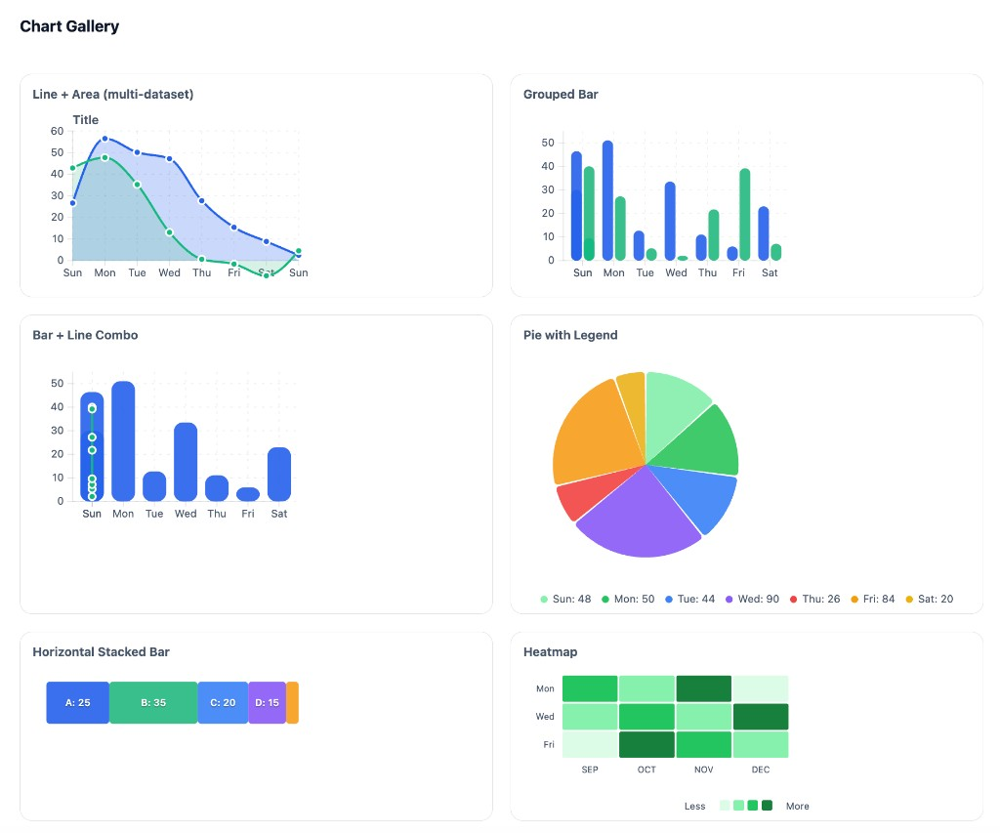

# react-modern-charts

A small, modern **SVG-first** React chart library using **d3-scale** and **d3-shape** for layout and path generation. Lightweight, themeable, and built for React 18+.



## Install

```bash
npm i d3-array d3-scale d3-shape
npm i react-modern-charts
```

Import CSS once:

```ts
import "react-modern-charts/styles.css";
```

## Quick Start

```tsx
import { scaleLinear } from "d3-scale";
import { ThemeProvider, Chart, LineSeries } from "react-modern-charts";
import "react-modern-charts/styles.css";

function App() {
  const data = [{ value: 10 }, { value: 25 }, { value: 15 }, { value: 40 }];
  const xScale = scaleLinear().domain([0, 3]).range([0, 360]);
  const yScale = scaleLinear().domain([0, 50]).range([160, 0]);

  return (
    <ThemeProvider mode="light">
      <Chart width={400} height={200} margin={{ top: 16, right: 16, bottom: 28, left: 40 }}>
        <LineSeries data={data} x={(_, i) => i} y={(d) => d.value} xScale={xScale} yScale={yScale} />
      </Chart>
    </ThemeProvider>
  );
}
```

## Chart Types

| Chart | Component | Description |
|-------|-----------|-------------|
| Line + Area | `LineSeries`, `AreaSeries` | Multi-dataset trends with filled regions |
| Grouped Bar | `GroupedBarSeries` | Side-by-side bars per category |
| Bar + Line Combo | `ComboChart` | Bars with overlaid line |
| Pie | `PieChart`, `PieSeries` | Pie/donut with optional legend |
| Stacked Bar | `StackedBarSeries` | Horizontal or vertical stacked segments |
| Heatmap | `HeatmapSeries` | Grid with color intensity |

**[Full chart documentation →](docs/CHARTS.md)** — Props, examples, and usage for each chart type.

## Build

```bash
npm i
npm run build
```

## Local Demo

Run the interactive playground:

```bash
cd .playground
npm i
npm run dev
```

## Exports

**Primitives:** `Chart`, `Grid`, `AxisBottom`, `AxisLeft`, `ThresholdLine`, `ChartTitle`, `Legend`  
**Series:** `LineSeries`, `AreaSeries`, `BarSeries`, `GroupedBarSeries`, `StackedBarSeries`, `PieSeries`, `HeatmapSeries`  
**Components:** `PieChart`, `ComboChart`  
**Theme:** `ThemeProvider`  
**Tooltips:** `TooltipPortal`, `DefaultTooltip`  
**Hooks:** `useChart`, `useNearestPoint`
